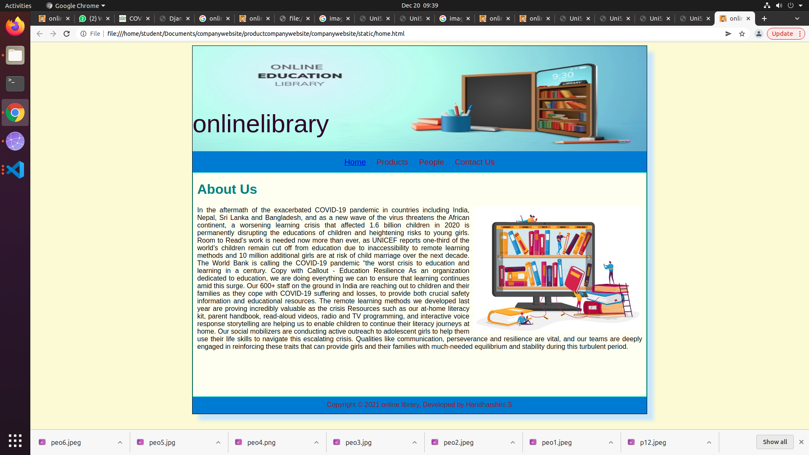
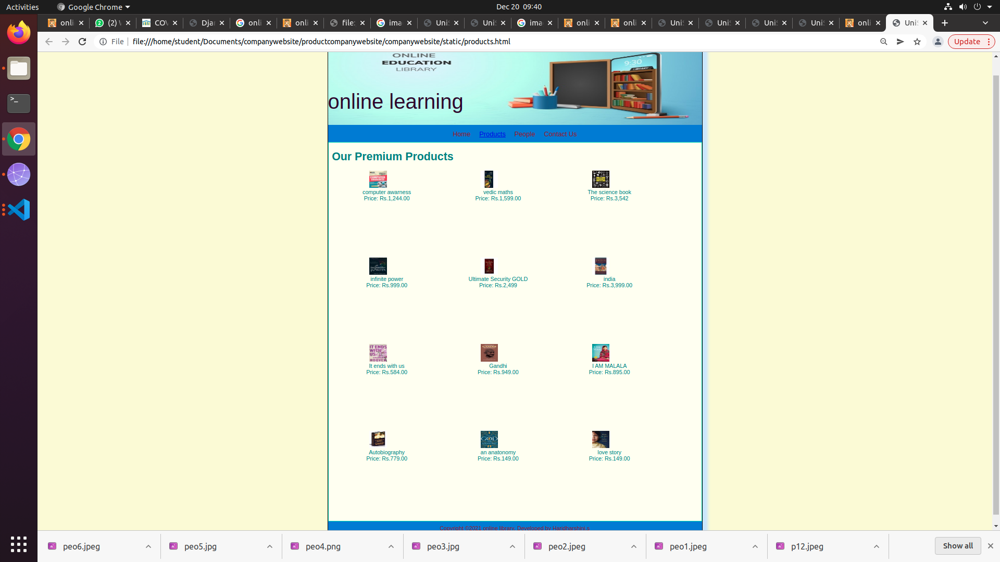
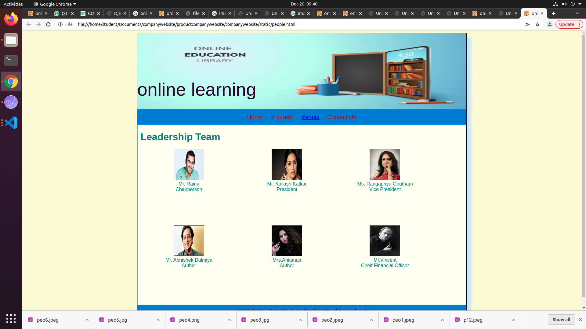
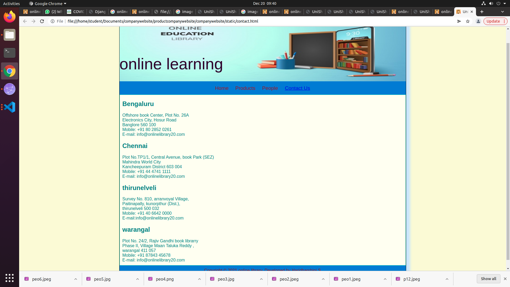

# Web Design for a Software Product Company

## AIM:

To design a static website for a software product company company.

## DESIGN STEPS:

### Step 1:

Requirement collection.

### Step 2:

Creating the layout using HTML and CSS.

### Step 3:

Updating the sample content.

### Step 4:

Choose the appropriate style and color scheme.

### Step 5:

Validate the layout in various browsers.

### Step 6:

Validate the HTML code.

### Step 6:

Publish the website in the given URL.

## PROGRAM :
### HOME.HTML:
```
<!DOCTYPE html>
<html lang="en">
    <head>
        <title>online library-Home</title>
        <link rel="stylesheet" href="./css/layout.css" />
        <link rel="icon" href="./img/logo1.jpeg" type="image/x-icon" />    
    </head>

    <body>
        <div class="container">
            <div class="banner">onlinelibrary </div>
            <div class="menu">
                <div class="menuitemselected"><a href="/static/home.html">Home</a></div>    
                <div class="menuitem"><a href="/static/products.html">Products</a></div>   
                <div class="menuitem"><a href="/static/people.html">People</a></div>  
                <div class="menuitem"><a href="/static/contact.html">Contact Us</a></div>           
            </div>
            <div class="content">
                <div class="homecontent">
                    <h1>About Us</h1>
                    
                    <div class="contenttext">
                    <p>In the aftermath of the exacerbated COVID-19 pandemic in countries including India, Nepal, Sri Lanka and Bangladesh, and as a new wave of the virus threatens the African continent, a worsening learning crisis that affected 1.6 billion children in 2020 is permanently disrupting the educations of children and heightening risks to young girls.
                      Room to Read’s work is needed now more than ever, as UNICEF reports one-third of the world’s children remain cut off from education due to inaccessibility to remote learning methods and 10 million additional girls are at risk of child marriage over the next decade. The World Bank is calling the COVID-19 pandemic “the worst crisis to education and learning in a century.
                      Copy with Callout - Education Resilience
                      As an organization dedicated to education, we are doing everything we can to ensure that learning continues amid this surge. Our 600+ staff on the ground in India are reaching out to children and their families as they cope with COVID-19 suffering and losses, to provide both crucial safety information and educational resources. The remote learning methods we developed last year are proving incredibly valuable as the crisis
                      Resources such as our at-home literacy kit, parent handbook, read-aloud videos, radio and TV programming, and interactive voice response storytelling are helping us to enable children to continue their literacy journeys at home. Our social mobilizers are conducting active outreach to adolescent girls to help them use their life skills to navigate this escalating crisis. Qualities like communication, perseverance and resilience are vital, and our teams are deeply engaged in reinforcing these traits that can provide girls and their families with much-needed equilibrium and stability during this turbulent period.</p>   
                      
                        
                    </div>
                </div>
            </div>
            <div class="footer">
                Copyright &#169; 2021 online library, Developed by Haridharshini.S
            </div>
        </div>
    </body>
</html>
```
### PRODUCT.HTML:
```
<!DOCTYPE html>
<html lang="en">
  <head>
    <title>UniShield-Products</title>
    <link rel="stylesheet" href="./css/layout.css" />
    <link rel="icon" href="./img/logo4.png" type="image/x-icon" />
  </head>

  <body>
    <div class="container">
      <div class="banner">online learning</div>
      <div class="menu">
        <div class="menuitem"><a href="/static/home.html">Home</a></div>
        <div class="menuitemselected"><a href="/static/products.html">Products</a></div>
        <div class="menuitem"><a>People</a></div>
        <div class="menuitem"><a>Contact Us</a></div>
      </div>
      <div class="content">
        <div class="productcontent">
          <h1>Our Premium Products</h1>
          <div class="productitems">
            <div class="productitem">
              <div class="itemimage">
              
              </div>
              <div class="itemname">computer awarness</div>
              <div class="itemprice">Price: Rs.1,244.00</div>
            </div>
            <div class="productitem">
              <div class="itemimage">
              
              </div>
              <div class="itemname">vedic maths</div>
              <div class="itemprice">Price: Rs.1,599.00</div>
            </div>
            <div class="productitem">
              <div class="itemimage">
              
              </div>
              <div class="itemname">The science book</div>
              <div class="itemprice">Price: Rs.3,542</div>
            </div>
            <div class="productitem">
              <div class="itemimage">
              
              </div>
              <div class="itemname">infinite power</div>
              <div class="itemprice">Price: Rs.999.00</div>
          </div>
          <div class="productitem">
            <div class="itemimage">
            
            </div>
            <div class="itemname">Ultimate Security GOLD</div>
            <div class="itemprice">Price: Rs.2,499</div>
          </div>
          <div class="productitem">
            <div class="itemimage">
            
            </div>
            <div class="itemname">india</div>
            <div class="itemprice">Price: Rs.3,999.00</div>
          </div>
          <div class="productitem">
              <div class="itemimage">
              
              </div>
              <div class="itemname">It ends with us</div>
              <div class="itemprice">Price: Rs.584.00</div>
            </div>
            <div class="productitem">
              <div class="itemimage">
              
              </div>
              <div class="itemname">Gandhi</div>
              <div class="itemprice">Price: Rs.949.00</div>
            </div>
            <div class="productitem">
              <div class="itemimage">
              
              </div>
              <div class="itemname">I AM MALALA</div>
              <div class="itemprice">Price: Rs.895.00</div>
            </div>
            <div class="productitem">
              <div class="itemimage">
              
              </div>
              <div class="itemname">Autobiography</div>
              <div class="itemprice">Price: Rs.779.00</div>
            </div>
            <div class="productitem">
              <div class="itemimage">
              
              </div>
              <div class="itemname">an anatonomy</div>
              <div class="itemprice">Price: Rs.149.00</div>
            </div>
            <div class="productitem">
              <div class="itemimage">
              
              </div>
              <div class="itemname">love story</div>
              <div class="itemprice">Price: Rs.149.00</div>
            </div>
          </div>
        </div>
      </div>      
      <div class="footer">
        Copyright &#169;2021 online library, Developed by Haridharshini.s
      </div>
    </div>
  </body>
</html>
```
### CSS :
```*{
  box-sizing: border-box;
  font-family: Arial, Helvetica, sans-serif;
}

body{
  background-color: lightgoldenrodyellow;
  
}

.container{
  width: 1080px;
  margin-left: auto;
  margin-right: auto;
  border-width: 1px 1px 1px 1px;
  border-style: solid;
  box-shadow: 15px 15px 8px #cce6ff
}

.banner{
  display: block;
  width: 100%;
  height: 250px;
  text-align: left;
  font-size: 60px;
  background-image:url("https://onlinelibrary.in/wp-content/uploads/1.jpg");
  background-size: 100% 100%;
  margin: 0px 0px 0px 0px;
  padding-top: 150px;
  color: rgb(44, 2, 44);
  font-family: 'Gill Sans', 'Gill Sans MT', Calibri, 'Trebuchet MS', sans-serif;
}

.banner img{
  float: left;
  width: 500px;
  height: 200px;
  margin-left: 10px; 
  margin-top: -125px;
}

.menu{
  display: block;
  width: 100%;
  height: 50px;
  font-size: larger;
  background-color: #197bd8;
  text-align: center;
  padding-top: 15px;
  margin: 0px 0px 0px 0px;
  border-width: 1px;
}

.menuitemselected{
  display: inline-block;
  margin-left: 10px;
  margin-right: 10px;
  color: #e8d870;
}

.menuitem{
  display: inline-block;
  margin-left: 10px;
  margin-right: 10px;
}

.menuitem a{
  text-decoration: none;
  color: #9c1018;
}


.content{
  display: block;
  width: 100%;
  background-color: ivory;
  min-height: 500px;
  margin: 0px 0px 0px 0px;
  border-width: 1px;
  border-color: rgb(31, 219, 179);
  border-style: solid;
  color: teal;
}

.homecontent{
  min-height: 500px;
  margin: 10px 10px 10px 10px;
}

.homecontent h1{
  text-align: left;
}

.homecontent img{
  float: right;
  width: 400px;
  height: 300px;
  margin-left: 10px;
}

.contenttext{
  text-align: justify;
  color:black;
}

.footer{
  display: block;
  width: 100%;
  height: 40px;
  background-color: #197bd8;
  text-align: center;
  padding-top: 10px;
  margin: 0px 0px 0px 0px;
  color: #9c1018;
}

.productcontent{
  min-height: 600px;
  margin: 10px 10px 10px 10px;
}

.productcontent h1{
  text-align: left;
}

.productitems{
  display: block;
}

.productitem{
  display: inline-block;
  width: 30%;
  height: 250px;
  margin-left: auto;
  margin-right: auto;
  text-align: center;
}

.productitem img {
  width: 50px;
  height: 50px;
  display: block;
}

.productitem .itemimage {
  display: block;
  margin-left: auto;
  margin-right: auto;
  width: 100px;
  margin-bottom: 3px;
}

.productitem .itemname {
  display: block;
}

.productitem .itemprice {
  display: block;
}

.peoplecontent{
  min-height: 500px;
  margin: 10px 10px 10px 10px;
}

.peoplecontent h1{
  text-align: left;
}

.peoplepics{
  display: block;
}

.peoplepic{
  display: inline-block;
  width: 30%;
  height: 250px;
  text-align: center;
}

.peoplepic img{
  width: 100px;
  height: 100px;
  display: block;
}

.peoplepic .peopleimage{
  display: block;
  margin-left: auto;
  margin-right: auto;
  width: 100px;
  margin-bottom: 5px;
}

.peoplepic .peoplename{
  display: block;
}

.peoplepic .peopledes{
  display: block;
}

.contactcontent{
  min-height: 500px;
  margin: 10px 10px 10px 10px;  
}

.contactitems{
  display: block;
}

.contactitem{
  display:block;
  text-align: left;
}

.contactitem .address{
  display: block;
  text-align: left;
}

.contactitem .number{
  display: block;
  text-align: left;
}

.conatctitem .email{
  display: block;
  text-align: left; 
}
```
### PEOPLE.HTML:
```<!DOCTYPE html>
<html lang="en">
    <head>
        <title>online library-People</title>
        <link rel="stylesheet" href="./css/layout.css" />
        <link rel="icon" href="./img/logo1.jpeg" type="image/x-icon" />    
    </head>

    <body>
        <div class="container">
            <div class="banner">online learning</div>
            <div class="menu">
                <div class="menuitem"><a href="/static/home.html">Home</a></div>    
                <div class="menuitem"><a href="/static/products.html">Products</a></div>   
                <div class="menuitemselected"><a href="/static/people.html">People</a></div>  
                <div class="menuitem"><a href="/static/contact.html">Contact Us</a></div>           
            </div>
            <div class="content">
                <div class="peoplecontent">
                    <h1>Leadership Team</h1>
                    <div class="peoplepics">
                        <div class="peoplepic">
                            <div class="peopleimage">
                                
                            </div>
                            <div class="peoplename">Mr. Raina</div>
                            <div class="peopledes">Chairperson</div>
                        </div>
                        <div class="peoplepic">
                            <div class="peopleimage">
                                
                            </div>
                            <div class="peoplename">Mr. Kailash Katkar</div>
                            <div class="peopledes">President</div>
                        </div>
                        <div class="peoplepic">
                            <div class="peopleimage">
                                
                            </div>
                            <div class="peoplename">Ms. Rangapriya Goutham</div>
                            <div class="peopledes">Vice President</div>
                        </div>
                        <div class="peoplepic">
                            <div class="peopleimage">
                                
                            </div>
                            <div class="peoplename">Mr. Abhishek Dalmiya</div>
                            <div class="peopledes">Author</div>
                        </div>
                        <div class="peoplepic">
                            <div class="peopleimage">
                                
                            </div>
                            <div class="peoplename">Mrs.Anitanair</div>
                            <div class="peopledes">Author</div>
                        </div>
                        <div class="peoplepic">
                            <div class="peopleimage">
                                
                            </div>
                            <div class="peoplename">Mr.Vincent</div>
                            <div class="peopledes">Cheif Financial Officer</div>
                        </div>
                    </div>
                </div>
            </div>
            <div class="footer">
                Copyright &#169;2021 online library developed by Haridharshini.S
              </div>
            </div>
    </body>
</html>
```
### CONTACT.HTML:
```
<!DOCTYPE html>
<html lang="en">
    <head>
        <title>UniShield-Contact Us</title>
        <link rel="stylesheet" href="./css/layout.css" />
        <link rel="icon" href="./img/logo1.jpeg" type="image/x-icon" />    
    </head>

    <body>
        <div class="container">
            <div class="banner">online learning </div>
            
            <div class="menu">
                <div class="menuitem"><a href="/static/home.html">Home</a></div>    
                <div class="menuitem"><a href="/static/products.html">Products</a></div>   
                <div class="menuitem"><a href="/static/people.html">People</a></div>  
                <div class="menuitemselected"><a href="/static/contact.html">Contact Us</a></div>           
            </div>
            <div class="content">
                <div class="contactcontent">
                    <div class="contactitems">
                        <div class="contactitem">
                            <h2>Bengaluru</h2>
                            <div class="address">Offshore book Center, Plot No. 26A<br>
                                Electronics City, Hosur Road<br>
                                Banglore 560 100</div>
                            <div class="number">Mobile: +91 80 2852 0261</div>
                            <div class="email">E-mail: info@onlinelibrary20.com</div>
                        </div>
                        <div class="contactitem">
                            <h2>Chennai</h2>
                            <div class="address">Plot No.TP1/1, Central Avenue, book Park (SEZ)<br>
                                Mahindra World City<br>
                                Kancheepuram District 603 004</div>
                            <div class="number">Mobile: +91 44 4741 1111</div>
                            <div class="email">E-mail: info@onlinelibrary20.com</div>
                        </div>
                        <div class="contactitem">
                            <h2>thirunelveli</h2>
                            <div class="address">Survey No. 810, arranvoyal  Village,<br>
                                Paitinapally, kunorpthur (Dist.),<br>
                                 thirunelveli 500 032</div>
                            <div class="number">Mobile: +91 40 6642 0000</div>
                            <div class="email">E-mail:info@onlinelibrary20.com </div>
                        </div>
                        <div class="contactplace">
                            <h2>warangal</h2>
                            <div class="address">Plot No. 24/2, Rajiv Gandhi book librarry<br>
                                Phase II, Village Maan Taluka Reddy , <br>
                                warangal 411 057</div>
                            <div class="number">Mobile: +91 87843 45678</div>
                            <div class="email">E-mail: info@onlinelibrary20.com</div>
                        </div>
                    </div>
                </div>
            </div>
            <div class="footer">
                Copyright &#169; 2021 online library, Developed by Haridharshini.S
            </div>
        </div>
    </body>
</html>
```
## OUTPUT:

### Home Page:



### Product page:


### People page:


### Contact page:


## Result:

Thus a website is designed for the software product company and the HTML,CSS code are validated.
